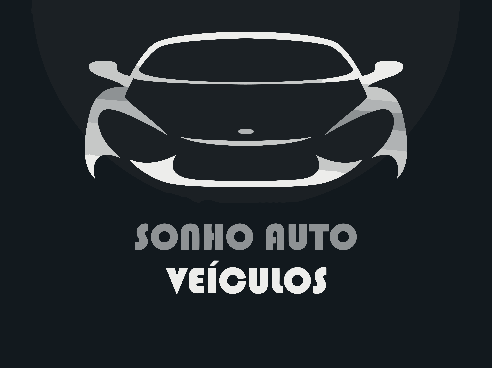

<h1 align="center">

</h1>

## 💻 Preview

    

## 🚀 Sobre o Projeto

Este projeto é um site insitucional para uma revendedora de veículos que contem as seguintes funcionalidades:

✔️ Troca de tema Light/Dark  
✔️ Página inicial contendo:  
&nbsp;&nbsp;&nbsp;➡️ Slider gerenciável pelo painel admin; 
&nbsp;&nbsp;&nbsp;➡️ Menu de Marcas e de Tipo de carroceria gerenciável pelo painel admin; 
&nbsp;&nbsp;&nbsp;➡️ Lista de veículos mais populares;   
✔️ Página Sobre Nós com conteúdo gerenciável pelo painel admin; 
✔️ Página de Veículos:  
&nbsp;&nbsp;&nbsp;➡️ Filtro com os atributos de veículos; 
&nbsp;&nbsp;&nbsp;➡️ Opção de diferentes ordenações; 
✔️ Página interna de veículo  
&nbsp;&nbsp;&nbsp;➡️ Contém todas as informações do veículo que são adicionadas pelo painel admin; 
✔️ Página de Favoritos que ficam armazenados no localStorage 
✔️ Página de Contato com conteúdo gerenciável pelo painel admin;  
✔️ Wordpress Headless para gerenciar todo conteúdo do site;  

## 🚀 Tecnologias

Paro o desenvolvimento utilizei as seguintes tecnologias:
- [React](https://reactjs.org/)
- [Next](https://nextjs.org/)
- [TypeScript](https://www.typescriptlang.org/)
- [Shadcn/ui](https://ui.shadcn.com/)
- [Tailwind CSS](https://tailwindcss.com/)
- [React hook form](https://react-hook-form.com/)
- [Zod](https://zod.dev/)
- [Resend](https://resend.com/)

## Links
* Repositório: https://github.com/lucasgmaieski/sonho-auto-veiculos
* Deploy: 
 
 

Feito com 💜 by Lucas Maieski
